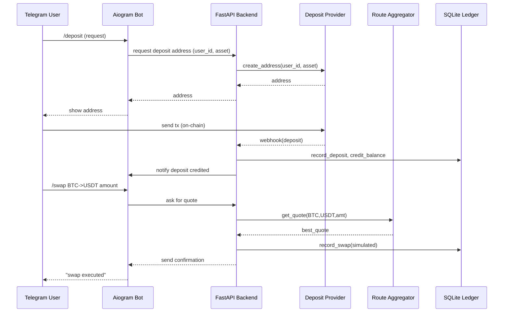

# Swaperex

Telegram crypto wallet bot with multi-route swap aggregation for the best rates.

## Features

- **Telegram Wallet**: Unique deposit addresses per user per asset
- **Balance Tracking**: SQLite ledger for deposits, balances, and swaps
- **Swap Aggregation**: Compare quotes from multiple routing providers
- **Cheapest Routes**: Automatically selects the best rate (no internal spread)
- **Admin Tools**: Debug commands and simulated deposits for testing

## Stage 1 (PoC) - Current

- Aiogram 3.x Telegram bot (polling mode)
- FastAPI backend for deposit webhooks
- SQLite database with async SQLAlchemy
- Simulated routing (DryRunRouter, SimulatedThorChain, SimulatedDexAggregator)
- No real funds - all balances are simulated

## Stage 2 (Planned)

- Real routing adapters (THORChain, DEX aggregators, MM2)
- Real deposit provider integration (CryptoAPIs, NOWPayments)
- HSM signing for secure key management (AWS KMS, GCP KMS)
- Withdrawal support
- Redis for FSM state (production)

## Architecture



## Roadmap

### Priority A - Core

1. **Provider Adapters** - CryptoAPIs / NOWPayments integration (done: interface)
2. **DEX Aggregator** - 0x/1inch testnet adapter
3. **MM2 Adapter** - AtomicDEX interface stub
4. **Ledger Integrity Tests** - Ensure balance consistency

### Priority B - Safety & Admin

5. **Admin Dashboard** - Protected /admin endpoints (done)
6. **Hot Wallet Guard** - Configurable balance thresholds

### Priority C - UX & Polish

7. **Interactive Swap Flow** - Inline keyboard UI
8. **History Export** - CSV download for users

### Priority D - Production

9. **Real Deposits** - CryptoAPIs/NOWPayments live integration
10. **Real Aggregator** - 0x/1inch mainnet calls
11. **KMS Signing** - AWS/GCP key management
12. **Security Audit** - Pen testing

## Quick Start

### Prerequisites

- Python 3.11+
- Telegram Bot Token (get from [@BotFather](https://t.me/BotFather))

### Installation

```bash
# Clone the repository
git clone https://github.com/yourusername/swaperex.git
cd swaperex

# Copy environment file
cp .env.example .env

# Edit .env with your bot token
# TELEGRAM_BOT_TOKEN=your_token_here

# Run development server
./scripts/start_dev.sh
```

### Manual Setup

```bash
# Create virtual environment
python3 -m venv .venv
source .venv/bin/activate

# Install dependencies
pip install -e ".[dev]"

# Create data directory
mkdir -p data

# Run migrations
python scripts/migrate.py

# Start the application (bot + API)
python -m swaperex.main
```

## Running

### Full Application (Bot + API)

```bash
./scripts/start_dev.sh
# or
python -m swaperex.main
```

### API Only

```bash
./scripts/run_api.sh
# or
uvicorn swaperex.api.app:app --reload --port 8000
```

### Bot Only

```bash
./scripts/run_bot.sh
# or
python -m swaperex.bot.bot
```

## Testing

```bash
# Run all tests
./scripts/run_tests.sh

# Run with coverage
pytest tests/ -v --cov=swaperex

# Run specific test file
pytest tests/test_ledger.py -v
```

## API Endpoints

| Endpoint | Method | Description |
|----------|--------|-------------|
| `/health` | GET | Basic health check |
| `/health/detailed` | GET | Detailed health with config |
| `/api/v1/deposits/webhook` | POST | Deposit webhook (from provider) |
| `/api/v1/deposits/simulate` | POST | Simulate deposit (dev only) |
| `/api/v1/deposits/{id}` | GET | Get deposit details |
| `/admin/balances` | GET | Aggregated balances (protected) |
| `/admin/stats` | GET | System statistics (protected) |
| `/admin/provider` | GET | Provider status (protected) |
| `/admin/users` | GET | List users with balances (protected) |

### Simulated Deposit (Development)

```bash
curl -X POST http://localhost:8000/api/v1/deposits/simulate \
  -H "Content-Type: application/json" \
  -d '{"telegram_id": 123456789, "asset": "BTC", "amount": "0.5"}'
```

## Bot Commands

### User Commands

| Command | Description |
|---------|-------------|
| `/start` | Start the bot, register user |
| `/help` | Show help message |
| `/wallet` | View all balances |
| `/deposit` | Get deposit address |
| `/swap` | Start swap flow |
| `/quote <from> <to> <amount>` | Get swap quote |
| `/history` | View transaction history |

### Admin Commands

| Command | Description |
|---------|-------------|
| `/admin` | Show admin commands |
| `/debug` | Show environment info |
| `/dryrun <from> <to> <amount>` | Test swap quote |
| `/simulate_deposit <asset> <amount>` | Add test funds |
| `/stats` | Show system statistics |

To enable admin commands, add your Telegram user ID to `ADMIN_USER_IDS` in `.env`.

## Project Structure

```
swaperex/
├── src/swaperex/
│   ├── api/              # FastAPI backend
│   │   ├── app.py        # App factory
│   │   └── routes/       # API endpoints
│   ├── bot/              # Telegram bot
│   │   ├── bot.py        # Bot setup
│   │   ├── keyboards.py  # Inline keyboards
│   │   └── handlers/     # Command handlers
│   ├── ledger/           # Database layer
│   │   ├── models.py     # SQLAlchemy models
│   │   ├── database.py   # DB connection
│   │   └── repository.py # Data access
│   ├── routing/          # Swap routing
│   │   ├── base.py       # Abstract interface
│   │   └── dry_run.py    # Simulated routers
│   ├── config.py         # Settings
│   └── main.py           # Entry point
├── tests/                # Unit tests
├── scripts/              # Utility scripts
├── data/                 # SQLite database
├── .env.example          # Environment template
└── pyproject.toml        # Project config
```

## Configuration

Environment variables (`.env`):

```bash
# Required
TELEGRAM_BOT_TOKEN=your_bot_token

# Optional - General
DATABASE_URL=sqlite+aiosqlite:///./data/swaperex.db
API_HOST=0.0.0.0
API_PORT=8000
ENVIRONMENT=development
DEBUG=true
DRY_RUN=true

# Admin
ADMIN_USER_IDS=123456789,987654321
ADMIN_TOKEN=your_admin_api_token

# Provider (Stage 2)
PROVIDER=dryrun  # dryrun, cryptoapis, nowpayments
CRYPTOAPIS_KEY=your_cryptoapis_key
NOWPAYMENTS_KEY=your_nowpayments_key

# Safety
HOT_WALLET_THRESHOLD=0.0  # 0 = disabled
```

### Admin API Access

```bash
# With token set
curl -H "x-admin-token: your_token" http://localhost:8000/admin/balances

# Response
{"balances":[{"asset":"BTC","total":0.5,"user_count":1}]}
```

If `ADMIN_TOKEN` is not set, endpoints are open (dev mode only).

## Routing Architecture

The routing system uses an abstract `RouteProvider` interface:

```python
class RouteProvider(ABC):
    @abstractmethod
    async def get_quote(self, from_asset, to_asset, amount) -> Quote:
        pass

    @abstractmethod
    async def execute_swap(self, route: SwapRoute) -> dict:
        pass
```

Current simulated providers:
- `DryRunRouter`: Zero-fee base router
- `SimulatedThorChainRouter`: Simulates THORChain fees (~0.3% + outbound)
- `SimulatedDexAggregator`: Simulates DEX aggregator fees (~0.1% + gas)

Stage 2 will add real implementations for:
- THORChain (cross-chain swaps)
- DEX aggregators (1inch, 0x, etc.)
- AtomicDEX/MM2

## Development

### Adding a New Router

1. Create a new file in `src/swaperex/routing/`
2. Implement `RouteProvider` interface
3. Add to aggregator in `dry_run.py:create_default_aggregator()`

### Adding Bot Commands

1. Create handler in `src/swaperex/bot/handlers/`
2. Register router in `handlers/__init__.py`

## License

MIT
